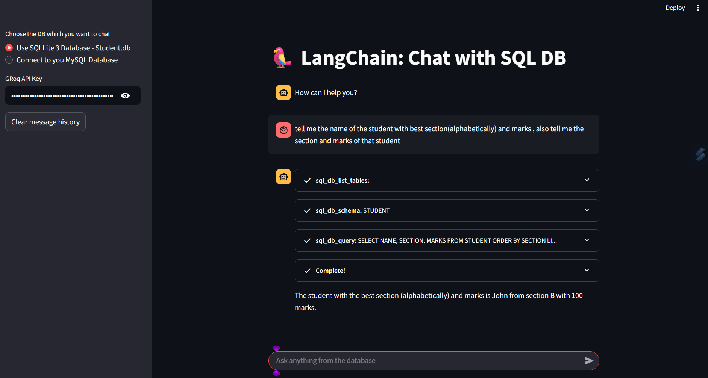
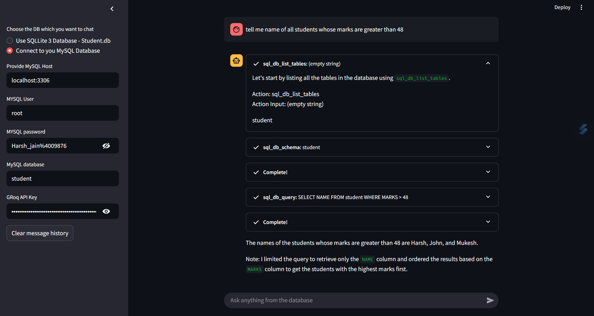

# LangSQL-Assistant

_A conversational interface for querying SQL databases using LangChain & Groq LLM_



<br>



## 🚀 Features

- 🗣️ **Natural-language → SQL**: Ask questions in plain English, get real SQL queries run under the hood.  
- 🐍 **Multi-DB support**: Toggle between a local SQLite file or your own MySQL instance.  
- 💬 **Streamlit UI**: Live chat interface with streaming LLM responses and SQLAgent action traces.  
- 🔄 **Automatic retry** on parsing hiccups (`handle_parsing_errors=True`).  
- 🔒 **Secure credentials**: Passwords & API keys pulled from sidebar inputs or a `.env` file.

## 🛠️ Installation

1. Clone the repo  
   ```bash
   git clone https://github.com/<your-org>/ChatDB-AI.git
   cd ChatDB-AI

2.Create & activate a venv
python3 -m venv .venv
source .venv/bin/activate   # Linux/macOS
.venv\Scripts\activate      # Windows

3.Install dependencies
pip install -r requirements.txt

4. Run in terminal 
streamlit run app.py

 -> In the sidebar, choose SQLite or MySQL.

    If MySQL, enter host (localhost:3306), user,password,  
    and database.

    Paste your GROQ API key.

    Ask anything:

    “List all students with marks > 80”

    The agent will show you the SQL it ran, then the final 
    answer.
